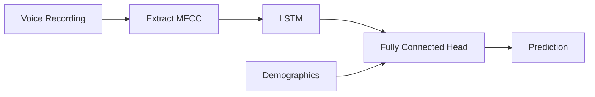

# PREPARE Challenge - Phase 2: Acoustic Track
This is my submission for the [PREPARE challenge](https://www.drivendata.org/competitions/299/competition-nih-alzheimers-acoustic-2/announcements/), a competition created by the NIH and the National Institute of Aging to encourage the analysis of voice data in the study of Alzheimer's disease and related dementias.

The challenge ended on Dec 28th, 2024.

# The Dataset
The data consists of $N=1646$ voice recordings, in English[^1] (79%), Spanish (19%), and Chinese (2%). Most of the recordings (70%) are exactly 30 seconds long, with the remaning ones roughly uniformly distributed in length down to 1.15s. Basic demographic information -age and sex- is available for all participants.

All the recordings are labeled as belonging to one of three classes: `control` cases, cases with mild cognitive impairment `mci`, and cases with dementia due to Alzheimer's disease `adrd`. 
Our goal is to build a classifier that assigns these labels to previously unseen recordings.

Unfortunately, the study participants are not all recorded while completing the same task: 
- Most English speakers are heard describing the Cookie Theft picture from the Boston diagnostic aphasia examination, but in some cases we have recording of spontaneous speech (an unstructured phone call with an interviewer) or even short commands given to an electronic home assistant ("When is thanksgiving? What's the weather today?").
- Most Spanish speakers are reading the beginning of Don Quixote
- Most Chinese speakers are recorded during the Animal Naming Test.

As a consequence, the nature of the recorded speech is not uniform. This means that it is reasonably safe to use some acoustic voice features (but not pauses, for example), while we cannot use linguistic features.

> **Warning:** all Chinese speakers are labeled as `mci`, which is probably a consequence of dataset construction. I suspect those participants were sampled from a study where mild cognitive impairment was part of the inclusion criteria.

# Architecture
In this repository I'm only showing the code for the best performing model, an LSTM followed by a fully connected head:

# Acknowledgements

The challenge was sponsored by the National Institute on Aging (NIA), an institute of the National Institute of Health (NIH), with support from NASA.

The MHAS (Mexican Health and Aging Study) is partly sponsored by the National Institutes of Health/National Institute on Aging (grant number NIH R01AG018016) in the United States and the Instituto Nacional de Estadística y Geografía (INEGI) in Mexico. Data files and documentation are public use and available at www.MHASweb.org.

The references for DementiaBank are:

- Becker, J. T., Boller, F., Lopez, O. L., Saxton, J., & McGonigle, K. L. (1994). The natural history of Alzheimer's disease: description of study cohort and accuracy of diagnosis. Archives of Neurology, 51(6), 585-594. Note: Please also acknowledge this grant support for the Pitt corpus -- NIA AG03705 and AG05133.
- Lanzi, A. M., Saylor, A. K., Fromm, D., Liu, H., MacWhinney, B., & Cohen, M. (2023). DementiaBank: Theoretical rationale, protocol, and illustrative analyses. American Journal of Speech-Language Pathology. doi.org/10.1044/2022_AJSLP-22-00281 

Reference for the competition and the DrivenData platform: https://arxiv.org/abs/1606.07781

# Notes

[^1]: I automatically detected the language of the recording using [Whisper's](https://github.com/openai/whisper) `detect_language()` method.